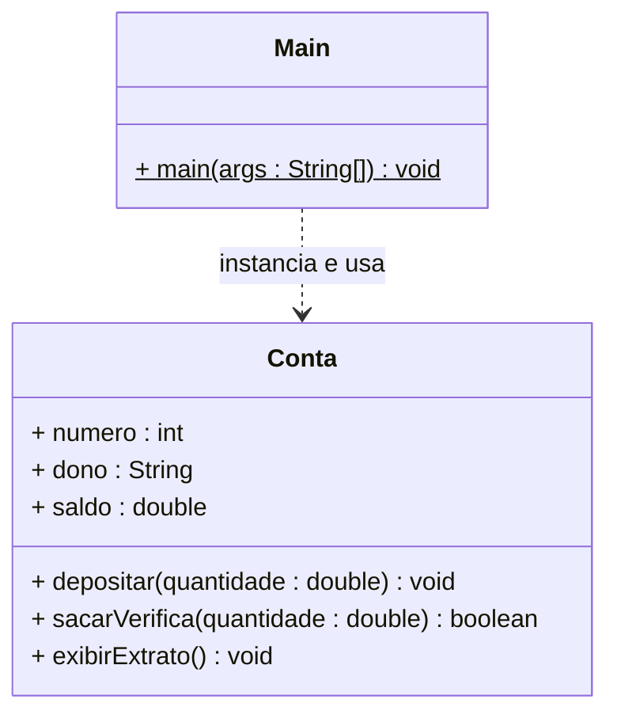

# Aula 04 — Introdução à Orientação a Objetos

---

## 🎯 Objetivos de Aprendizagem

Ao final desta aula, você será capaz de:

- Explicar a diferença filosófica entre o paradigma **estruturado** e o **orientado a objetos**
- Identificar os **atributos** (estado) e os **métodos** (comportamento) de um objeto do mundo real e traduzi-los para Java
- Declarar uma **classe** com a sintaxe correta e compreender seu papel como molde
- Instanciar **objetos** com o operador `new` e acessar seus membros via notação de ponto
- Distinguir e implementar métodos **`void`** (sem retorno) e métodos **com retorno**
- Utilizar a palavra-chave **`this`** para referenciar o próprio objeto dentro de um método
- Reconhecer o valor **`null`** e o risco da `NullPointerException`

---

## 1. O Problema que a POO Resolve

Até aqui, programamos de forma **estruturada**: lógica dentro do `main`, variáveis soltas, funções estáticas recebendo dados como parâmetros. Esse estilo funciona para programas pequenos, mas começa a mostrar suas limitações quando o sistema cresce.

Imagine modelar uma conta bancária de forma estruturada:

```java
// ⚠️ ESTILO ESTRUTURADO — funciona, mas não escala
public class ProgramaEstruturado {
    public static void main(String[] args) {

        // Estado da conta: variáveis soltas, sem nenhuma organização
        int    numeroConta = 1001;
        String dono        = "Ana Lima";
        double saldo       = 500.00;

        // Operação de depósito: lógica separada dos dados
        double valorDeposito = 200.00;
        if (valorDeposito > 0) {
            saldo += valorDeposito;
        }

        // Se houver uma segunda conta, repetimos tudo:
        int    numeroConta2 = 1002;
        String dono2        = "Carlos Neto";
        double saldo2       = 300.00;
        // ... e toda a lógica de depósito e saque de novo...
    }
}
```

Os dados (`saldo`, `dono`) e a lógica que os manipula (`if (valorDeposito > 0)`) vivem em lugares diferentes e sem relação formal. Para uma segunda conta, duplicamos tudo. Para dez contas, o código se torna inviável.

A **Programação Orientada a Objetos** propõe uma solução diferente: **agrupar os dados e a lógica que os manipula em uma única unidade — o objeto**.

---

## 2. Dois Paradigmas, Dois Focos

| Critério | Paradigma Estruturado | Paradigma Orientado a Objetos |
|---|---|---|
| **Unidade principal** | Funções / procedimentos | Objetos (dados + comportamento juntos) |
| **Como os dados trafegam** | Passados como parâmetros entre funções | Encapsulados dentro de cada objeto |
| **Reutilização de código** | Copiar e colar funções | Herança e composição |
| **Modela o mundo como** | Sequência de ações | Colaboração entre entidades |
| **Pergunta central** | *O que o programa faz?* | *Quais entidades existem e como colaboram?* |
| **Exemplos de linguagem** | C, Pascal, COBOL | Java, Python, C#, Ruby |

> 💡 **Dica:** Java é uma linguagem orientada a objetos, mas permite que você escreva código de estilo estruturado dentro do `main`. O desafio desta disciplina é justamente desenvolver o **raciocínio orientado a objetos** — aprender a pensar em entidades antes de pensar em passos.

---

## 3. Classe e Objeto — Molde e Instância

### A Analogia da Forma de Bolo

Pense em uma **forma de bolo**. Ela define exatamente o formato e o tamanho que todos os bolos produzidos a partir dela terão. A forma em si, porém, não tem sabor, não tem massa, não pode ser comida. Ela é apenas a definição.

| Conceito | Analogia | Em Java |
|---|---|---|
| **Classe** | A forma de bolo | Definição que existe no código-fonte |
| **Objeto** | O bolo pronto | Entidade real que existe na memória em tempo de execução |
| **Instanciar** | Assar o bolo usando a forma | Executar `new NomeDaClasse()` |

Uma única classe pode gerar **quantos objetos forem necessários**, cada um com seus próprios dados, completamente independentes entre si:

```
Classe Conta (molde)
        │
        ├──► objeto conta1  { dono="Ana",    saldo=500.00 }
        ├──► objeto conta2  { dono="Bruno",  saldo=1200.00 }
        └──► objeto conta3  { dono="Carla",  saldo=0.00 }
```

### Do Mundo Real para o Código

Todo objeto do mundo real possui dois tipos de características que mapeamos diretamente para Java:

| Característica do objeto real | Nome em POO | Em Java |
|---|---|---|
| O que o objeto **tem** (seus dados) | **Atributos** / Estado | Variáveis declaradas dentro da classe |
| O que o objeto **faz** (suas ações) | **Métodos** / Comportamento | Funções declaradas dentro da classe |

Veja como isso se aplica a objetos do cotidiano:

| Objeto Real | Atributos (Estado) | Métodos (Comportamento) |
|---|---|---|
| Conta Bancária | número, dono, saldo | depositar, sacar, consultarSaldo |
| Aluno | nome, matrícula, nota | calcularMedia, verificarAprovacao |
| Carro | modelo, cor, velocidade | acelerar, frear, ligar |

---

## 4. Anatomia de uma Classe em Java

Uma classe em Java é declarada com a seguinte estrutura:

```java
//  modificador  palavra-chave  nome (por convenção: PascalCase)
    public       class          NomeDaClasse {

    // ── 1. ATRIBUTOS ─────────────────────────────────────────────────────────
    // Variáveis que guardam o ESTADO de cada objeto
    Tipo nomeDoAtributo;

    // ── 2. MÉTODOS ───────────────────────────────────────────────────────────
    // Funções que definem o COMPORTAMENTO do objeto
    TipoDeRetorno nomeDoMetodo(Tipo parametro) {
        // corpo do método
    }
}
```

Três regras essenciais que você deve memorizar:

1. O **nome do arquivo** `.java` deve ser **idêntico** ao nome da classe pública
2. Atributos e métodos vivem **dentro das chaves** `{ }` da classe
3. O nome da classe segue a convenção **PascalCase**: cada palavra começa com maiúscula (`ContaBancaria`, `NomeCompleto`)

---

## 5. Métodos `void` e Métodos com Retorno

Métodos são as ações que um objeto sabe executar. Eles se dividem em dois tipos pelo que devolvem para quem os chamou:

| Tipo | Palavra-chave | Quando usar | Obrigatoriedade |
|---|---|---|---|
| **Sem retorno** | `void` | Quando a ação apenas *faz algo* (imprime, atualiza, salva) | Não precisa de `return` |
| **Com retorno** | Tipo do valor | Quando a ação *calcula ou verifica algo* e precisa informar o resultado | **Obrigatório** ter `return` do tipo declarado |

```java
// ── Método void: faz algo, não devolve nada ───────────────────────────────
void depositar(double quantidade) {
    this.saldo += quantidade;
    // não há return — o trabalho está feito
}

// ── Método com retorno boolean: calcula, decide e informa o resultado ─────
boolean sacarVerifica(double quantidade) {
    if (quantidade > this.saldo) {
        return false; // ← devolve false: operação não realizada
    }
    this.saldo -= quantidade;
    return true;      // ← devolve true: operação realizada com sucesso
}

// ── Método com retorno double: calcula e devolve um valor ─────────────────
double getSaldo() {
    return this.saldo; // ← devolve o valor atual do saldo
}
```

> ⚠️ **Aviso de Professora:** Se você declarar um método com tipo de retorno (ex: `boolean`) e não colocar o `return` em todos os caminhos de execução possíveis, o compilador emitirá o erro `"missing return statement"`. O Java verifica estaticamente se todo caminho leva a um `return` do tipo correto.

---

## 6. A Palavra-Chave `this`

Dentro de qualquer método de instância, **`this`** é uma referência que aponta para o **próprio objeto** que está executando o método.

Seu uso mais comum é resolver a **ambiguidade de nomes** quando o parâmetro de um método tem o mesmo nome que um atributo:

```java
public class Conta {
    double saldo;           // ← atributo do objeto

    void depositar(double saldo) {      // ← parâmetro com o mesmo nome
        // Sem 'this': o Java lê 'saldo = saldo', ou seja, o parâmetro recebe a si mesmo.
        // O atributo do objeto nunca é atualizado — bug silencioso!
        saldo = saldo;       // ❌ não faz o que parece

        // Com 'this': deixa claro que o lado esquerdo é o ATRIBUTO do objeto
        this.saldo = saldo;  // ✅ atributo do objeto recebe o valor do parâmetro
    }
}
```

> 💡 **Dica:** Mesmo quando não há ambiguidade, usar `this.atributo` é uma convenção que torna o código mais explícito — deixa claro para quem lê que você está falando de um atributo do objeto, não de uma variável local. Você verá esse padrão amplamente nos exemplos desta disciplina.

---

## 7. O Operador `new` e a Instanciação

Para criar um objeto (instância) a partir de uma classe, usamos o operador **`new`**:

```java
//  tipo   nome da variável  operador  construtor da classe
    Conta  minhaConta      = new      Conta();
//    ↑           ↑                      ↑
// declara    apelido local        cria o objeto na memória
// a variável  que usaremos         e devolve uma referência
```

O que acontece nos bastidores desta linha:

1. O Java reserva um espaço na **memória heap** para guardar o objeto
2. Os atributos são inicializados com seus **valores padrão** (`0` para numéricos, `null` para objetos, `false` para boolean)
3. Uma **referência** (endereço de memória) é devolvida e armazenada na variável `minhaConta`

Após criar o objeto, acessamos seus membros com a **notação de ponto** (`.`):

```java
Conta minhaConta = new Conta();

// Escrevendo em atributos
minhaConta.numero = 1001;
minhaConta.dono   = "Ana Lima";
minhaConta.saldo  = 500.00;

// Chamando métodos
minhaConta.depositar(200.00);
boolean sucesso = minhaConta.sacarVerifica(100.00);

// Lendo atributos
System.out.println("Saldo: " + minhaConta.saldo);
```

---

## 8. Referências e `null` — Cuidado com o Abismo

A variável `minhaConta` **não é o objeto**. Ela é uma **referência** — um apontador para onde o objeto vive na memória. Essa distinção tem uma consequência prática importante:

```java
Conta contaA;           // variável declarada, mas ainda não aponta para nenhum objeto
                        // seu valor é 'null' — referência para "nada"

// contaA.depositar(100); // ❌ NullPointerException!
//                           não há objeto na memória para receber a mensagem

contaA = new Conta();   // agora sim: o objeto existe e contaA aponta para ele
contaA.depositar(100);  // ✅ funciona corretamente
```

```
 Variável contaA
 ┌─────────────┐
 │    null     │  ← antes do 'new': aponta para nada
 └─────────────┘

 Variável contaA         Memória (Heap)
 ┌─────────────┐        ┌─────────────────────────┐
 │  ref → ───────────►  │  Objeto Conta           │
 └─────────────┘        │  numero : 0             │
                        │  dono   : null          │
                        │  saldo  : 0.0           │
                        └─────────────────────────┘
```

> ⚠️ **Aviso de Professora:** A `NullPointerException` é uma das exceções mais comuns em Java. Ela ocorre sempre que você tenta chamar um método ou acessar um atributo em uma variável que ainda vale `null`. Sempre que criar uma variável de tipo objeto, pergunte-se: *eu já executei o `new` antes de usar essa variável?*

---

## 9. Independência entre Objetos

Cada objeto possui sua **própria cópia** de todos os atributos declarados na classe. Alterar o estado de um objeto **jamais** afeta outro:

```java
Conta conta1 = new Conta();
conta1.dono  = "Ana Lima";
conta1.saldo = 500.00;

Conta conta2 = new Conta();
conta2.dono  = "Bruno Costa";
conta2.saldo = 1200.00;

conta1.depositar(300.00); // saldo de conta1 vai para 800.00
                          // saldo de conta2 permanece 1200.00 — intocado

System.out.println(conta1.saldo); // 800.0
System.out.println(conta2.saldo); // 1200.0 ← não foi afetado
```

```
 conta1 ──►  { dono="Ana",   saldo=800.00  }   ← objetos independentes
 conta2 ──►  { dono="Bruno", saldo=1200.00 }      na memória
```

---

## 10. Diagrama de Classe UML

Antes de implementar, visualizamos o design com a notação UML. O diagrama de classe representa a **estrutura** da classe — seus atributos e métodos com seus tipos:



> 📌 **Notação UML neste diagrama:**
> O símbolo `+` indica membros públicos. O símbolo `$` indica membro estático. A linha tracejada com seta (`..>`) indica uma relação de dependência: `Main` *usa* `Conta`, mas não é uma `Conta`.

---

## 11. Implementação Completa

### 11.1 — `Conta.java`

```java
/**
 * Modela uma conta bancária simples com atributos e comportamentos básicos.
 * Esta é a versão inicial — nas próximas aulas aplicaremos encapsulamento
 * com modificadores de acesso private e getters/setters.
 *
 * @author Juliana Costa-Silva
 * @version 1.0
 */
public class Conta {

    // ── ATRIBUTOS (Estado do objeto) ─────────────────────────────────────────
    // Nesta versão inicial os atributos são de visibilidade padrão (sem modificador).
    // Na Aula 05 aprenderemos por que isso é problemático e como corrigi-lo.
    int    numero;
    String dono;
    double saldo;

    // ── MÉTODOS (Comportamento do objeto) ────────────────────────────────────

    /**
     * Credita um valor no saldo da conta.
     * Método void: realiza a ação e não devolve nenhum resultado.
     *
     * @param quantidade Valor a depositar (deve ser positivo)
     */
    void depositar(double quantidade) {
        if (quantidade > 0) {
            this.saldo += quantidade;
            System.out.printf("✅ Depósito de R$%.2f realizado. Saldo: R$%.2f%n",
                              quantidade, this.saldo);
        } else {
            System.out.println("❌ Erro: o valor do depósito deve ser positivo.");
        }
    }

    /**
     * Tenta debitar um valor do saldo da conta.
     * Método com retorno boolean: executa a lógica e informa se teve sucesso.
     *
     * @param  quantidade Valor a sacar
     * @return true se o saque foi realizado; false se saldo insuficiente
     */
    boolean sacarVerifica(double quantidade) {
        if (quantidade <= 0) {
            System.out.println("❌ Erro: o valor do saque deve ser positivo.");
            return false;
        }

        if (quantidade > this.saldo) {
            System.out.printf("❌ Saldo insuficiente. Saldo atual: R$%.2f%n", this.saldo);
            return false;           // ← informa a quem chamou: operação não realizada
        }

        this.saldo -= quantidade;
        System.out.printf("✅ Saque de R$%.2f realizado. Saldo: R$%.2f%n",
                          quantidade, this.saldo);
        return true;                // ← informa a quem chamou: sucesso
    }

    /**
     * Exibe um extrato formatado da conta no console.
     * Método void: a responsabilidade é exibir, não calcular.
     */
    void exibirExtrato() {
        System.out.println("╔══════════════════════════════╗");
        System.out.printf( "║  Conta Nº  : %-15d ║%n", numero);
        System.out.printf( "║  Titular   : %-15s ║%n", dono);
        System.out.printf( "║  Saldo     : R$ %,-10.2f   ║%n", saldo);
        System.out.println("╚══════════════════════════════╝");
    }
}
```

### 11.2 — `Main.java`

```java
import java.util.Scanner;

/**
 * Classe principal: demonstra a criação e uso de objetos Conta.
 * Combina instanciação, chamadas de método e entrada de dados via Scanner.
 */
public class Main {

    public static void main(String[] args) {
        Scanner input = new Scanner(System.in);

        System.out.println("══════════════════════════════════");
        System.out.println("   SISTEMA BANCÁRIO — VERSÃO 1.0  ");
        System.out.println("══════════════════════════════════\n");

        // ── 1. CRIAÇÃO DOS OBJETOS ───────────────────────────────────────────
        // Dois objetos da mesma classe, completamente independentes na memória
        Conta conta1 = new Conta();
        conta1.numero = 1001;
        conta1.dono   = "Ana Lima";
        conta1.saldo  = 500.00;

        Conta conta2 = new Conta();
        conta2.numero = 1002;
        conta2.dono   = "Bruno Costa";
        conta2.saldo  = 1200.00;

        // ── 2. INTERAÇÃO COM O USUÁRIO VIA Scanner ───────────────────────────
        System.out.println("Operações para a conta de: " + conta1.dono);
        System.out.print("Digite o valor para depósito: ");
        double valorDeposito = input.nextDouble();
        conta1.depositar(valorDeposito);

        System.out.println();

        System.out.print("Digite o valor para saque: ");
        double valorSaque = input.nextDouble();

        // O retorno booleano de sacarVerifica() nos permite reagir ao resultado
        boolean saqueRealizado = conta1.sacarVerifica(valorSaque);
        if (!saqueRealizado) {
            System.out.println("Operação de saque cancelada.");
        }

        System.out.println();

        // ── 3. EXIBINDO ESTADOS FINAIS — cada objeto tem o seu próprio estado
        System.out.println("── Extrato Final ──────────────────");
        conta1.exibirExtrato();
        System.out.println();
        conta2.exibirExtrato(); // conta2 não foi alterada — confirma a independência

        input.close();
    }
}
```

**Exemplo de execução:**

```
══════════════════════════════════
   SISTEMA BANCÁRIO — VERSÃO 1.0
══════════════════════════════════

Operações para a conta de: Ana Lima
Digite o valor para depósito: 300.00
✅ Depósito de R$300,00 realizado. Saldo: R$800,00

Digite o valor para saque: 950.00
❌ Saldo insuficiente. Saldo atual: R$800,00
Operação de saque cancelada.

── Extrato Final ──────────────────
╔══════════════════════════════╗
║  Conta Nº  : 1001            ║
║  Titular   : Ana Lima        ║
║  Saldo     : R$ 800,00       ║
╚══════════════════════════════╝

╔══════════════════════════════╗
║  Conta Nº  : 1002            ║
║  Titular   : Bruno Costa     ║
║  Saldo     : R$ 1.200,00     ║
╚══════════════════════════════╝
```

---

## 12. Comparativo: Estruturado vs. Orientado a Objetos

O mesmo sistema bancário nas duas abordagens:

| Critério | Estilo Estruturado | Estilo OO (com a classe `Conta`) |
|---|---|---|
| **Dados de 3 contas** | 9 variáveis soltas (`numero1`, `dono1`, `saldo1`, `numero2`...) | 3 objetos: `conta1`, `conta2`, `conta3` |
| **Lógica de saque** | Escrita diretamente no `main`, repetida para cada conta | Encapsulada em `sacarVerifica()` — escrita uma vez, usada por todos os objetos |
| **Adicionar uma 4ª conta** | Declarar mais 3 variáveis, duplicar a lógica | `Conta conta4 = new Conta()` — pronto |
| **Alterar a regra de saque** | Localizar e alterar em cada bloco do `main` | Alterar somente o método `sacarVerifica()` na classe |
| **Legibilidade** | `if (valorSaque > saldo1)` — o dado e a lógica distantes | `conta1.sacarVerifica(valor)` — a mensagem vai direto ao responsável |

---

## 13. Onde Estamos no Roteiro da Disciplina

```
Aula 04 — Você está aqui ▼
│
├── ✅ Classe e Objeto
├── ✅ Atributos e Métodos
├── ✅ new, this, null
│
▼ Aula 05: Encapsulamento
│   Os atributos desta aula são visíveis de fora (sem modificador).
│   Na próxima aula aprenderemos por que isso é perigoso e como
│   protegê-los com 'private', getters e setters.
│
▼ Aula 06: Construtores e Herança
    Criaremos construtores para garantir que nenhum objeto nasça
    com estado indefinido, e estenderemos classes com 'extends'.
```

> 💡 **Observe com atenção:** na classe `Conta` desta aula, os atributos não têm nenhum modificador de acesso, o que significa que qualquer código externo pode fazer `conta1.saldo = -999999`. Essa vulnerabilidade é intencional neste momento — ela é o problema que a **Aula 05 (Encapsulamento)** resolve.

---

## 🛠️ Atividades Práticas

### Atividade 1 — Leitura e Rastreamento de Código

Analise o trecho abaixo **sem executar**. Determine o valor impresso em cada `println`:

```java
Conta c1 = new Conta();
c1.dono  = "Mariana";
c1.saldo = 600.00;

Conta c2 = new Conta();
c2.dono  = "Pedro";
c2.saldo = 400.00;

c1.depositar(200.00);
c2.sacarVerifica(500.00);   // tentativa — saldo insuficiente
c1.sacarVerifica(150.00);

System.out.println(c1.saldo); // → ?
System.out.println(c2.saldo); // → ?
```

Responda:
- Qual o valor de `c1.saldo` ao final?
- Qual o valor de `c2.saldo` ao final? Por quê?
- O retorno de `c2.sacarVerifica(500.00)` é `true` ou `false`?

---

### Atividade 2 — Completando a Classe `Conta`

A partir do código fornecido em aula, adicione os seguintes membros à classe `Conta`:

**Novo atributo:**
- `int totalOperacoes` — inteiro que conta quantas chamadas de `depositar` ou `sacarVerifica` foram executadas **com sucesso** neste objeto (não conta tentativas inválidas)

**Novo método `void`:**
- `transferir(Conta destino, double valor)` — debita desta conta e credita na conta `destino`; use os métodos `sacarVerifica()` e `depositar()` internamente; só transfira se o saque for bem-sucedido

**Novo método com retorno:**
- `boolean isPositiva()` — retorna `true` se o saldo for maior que zero

**Requisitos:**
- Incremente `totalOperacoes` nos locais corretos
- Escreva um `main` de teste que demonstre as três adições

---

### Atividade 3 — Da Entidade ao Código

Modele e implemente do zero a classe `Aluno` para um sistema de boletim escolar:

**Atributos:**
- `String nome`
- `int matricula`
- `double nota1`, `double nota2`, `double nota3`

**Métodos `void`:**
- `exibirBoletim()` — imprime nome, matrícula, as três notas e a média formatada com 1 casa decimal

**Métodos com retorno:**
- `double calcularMedia()` — retorna a média aritmética das três notas
- `boolean isAprovado()` — retorna `true` se a média for maior ou igual a 6.0
- `String getSituacao()` — retorna `"Aprovado"`, `"Recuperação"` (média entre 4.0 e 5.9) ou `"Reprovado"`

**Requisitos:**
- Crie um `main` que instancie dois alunos com notas diferentes
- Use `if (!aluno.isAprovado())` para exibir uma mensagem de aviso específica
- O `exibirBoletim()` deve chamar `calcularMedia()` e `getSituacao()` internamente — não duplique a lógica

---

### Atividade 4 — Desafio: Sistema de Estoque Simples

Modele uma classe `Produto` para um sistema de controle de estoque e uma classe `TesteEstoque` para testá-la:

**Atributos:**
- `String nome`
- `double preco`
- `int quantidadeEmEstoque`

**Métodos `void`:**
- `entradaEstoque(int quantidade)` — adiciona ao estoque; impede valores negativos ou zero
- `saidaEstoque(int quantidade)` — remove do estoque; impede que o estoque fique negativo; imprime aviso se a quantidade pedida for maior que o disponível
- `exibirFicha()` — imprime todos os dados formatados, incluindo o **valor total em estoque** (`preco * quantidadeEmEstoque`)

**Métodos com retorno:**
- `boolean isDisponivel()` — retorna `true` se `quantidadeEmEstoque > 0`
- `double getValorTotalEmEstoque()` — retorna `preco * quantidadeEmEstoque`

**Em `TesteEstoque.java`:**
- Instancie 3 produtos com preços e quantidades diferentes
- Realize entradas e saídas de estoque, incluindo pelo menos uma operação inválida
- Verifique a disponibilidade de cada produto com `isDisponivel()`
- Calcule e exiba o **valor total do estoque** somando `getValorTotalEmEstoque()` dos três produtos

---

## 📚 Referências e Leituras Recomendadas

| Recurso | Capítulos | Relevância |
|---|---|---|
| Deitel & Deitel — *Java: Como Programar* (10ª ed.) | Cap. 3 (Introdução a Classes, Objetos, Métodos e Strings) | ⭐⭐⭐ Essencial |
| Horstmann & Cornell — *Core Java* Vol. I | Cap. 4.1–4.4 (Classes, Objects, and Methods) | ⭐⭐⭐ Essencial |
| Silveira & Amaral — *Java SE 8 Programmer I* | Cap. 4 (Orientação a Objetos) | ⭐⭐ Recomendado |
| Oracle — [Java Tutorials: Classes and Objects](https://docs.oracle.com/javase/tutorial/java/javaOO/index.html) | — | ⭐⭐ Recomendado |

---

## 🚀 Próximos Passos

- Perceber na prática o problema dos atributos sem modificador de acesso: tente corromper `conta1.saldo` diretamente e reflita sobre o que isso significa para a robustez do sistema
- Preparar-se para a **Aula 05 (Encapsulamento)**: como `private`, getters e setters blindam a classe `Conta` contra estados inválidos

---

*← [Aula 03 — Estruturas de Controle](aula03.md) · [Aula 05 — Encapsulamento e Membros Estáticos →](aula05.md)*

[⬅️ Voltar ao Início](README.md)
