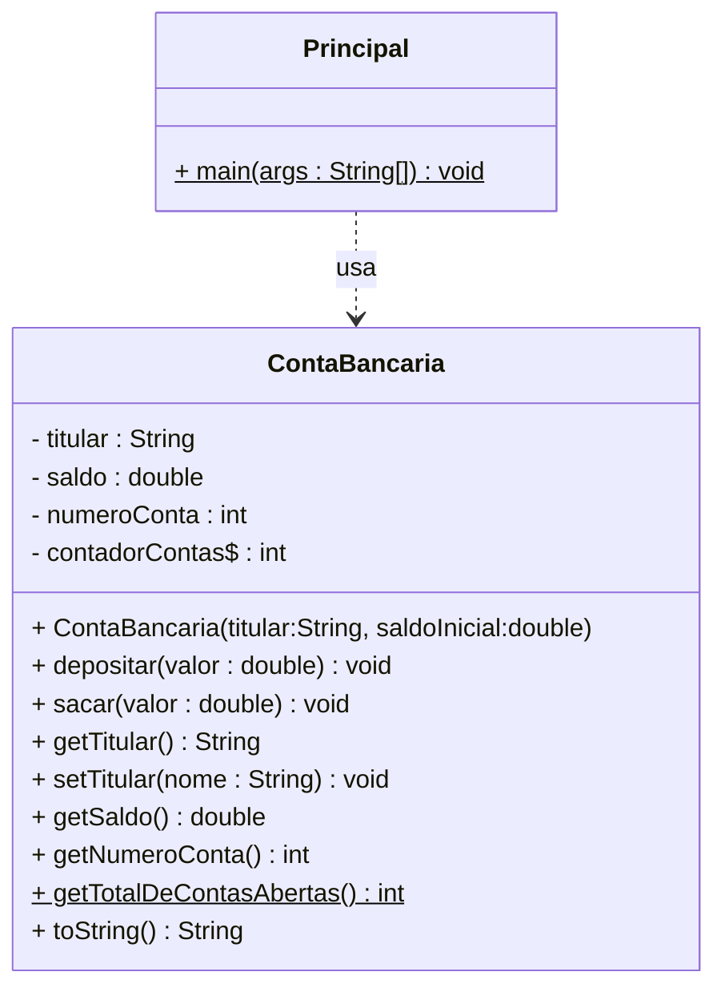

# Aula 05 — Encapsulamento, Getters/Setters e Membros Estáticos


## 🎯 Objetivos de Aprendizagem

Ao final desta aula, você será capaz de:

- Explicar o conceito de **Encapsulamento** e sua importância para a integridade dos dados
- Aplicar os modificadores de acesso **`private`** e **`public`** de forma estratégica
- Criar **Getters e Setters** robustos com validações de regras de negócio
- Utilizar a palavra-chave **`this`** para referenciar o objeto atual
- Declarar e usar **membros estáticos (`static`)** para gerenciar recursos compartilhados pela classe
- Distinguir na prática o comportamento de **atributos de instância** versus **atributos de classe**

---

## 1. O Problema Que o Encapsulamento Resolve

Antes de entender a solução, precisamos sentir o problema. Observe esta classe **sem** encapsulamento:

```java
// ⚠️ EXEMPLO DO QUE NÃO FAZER
public class ContaSemProtecao {
    public String titular;
    public double saldo;      // atributo público = porta aberta para qualquer um
    public int numeroConta;
}
```

Com atributos `public`, qualquer código externo pode fazer isso:

```java
ContaSemProtecao conta = new ContaSemProtecao();
conta.titular = "";           // nome vazio — dado inválido aceito
conta.saldo   = -50000.00;    // saldo negativo — estado impossível no mundo real
conta.numeroConta = 0;        // número inexistente
```

Nenhum erro de compilação. Nenhum aviso. O programa aceita silenciosamente **dados corrompidos** e o sistema bancário passa a ter contas com saldo negativo e titulares sem nome. Esse é exatamente o problema que o **Encapsulamento** resolve.

---

## 2. Encapsulamento — A "Cápsula" de Proteção

O **Encapsulamento** é o pilar da POO que **isola os detalhes internos** de uma classe, expondo apenas o que é estritamente necessário através de uma interface controlada e segura.

A receita é simples e poderosa:

1. Declare todos os atributos como **`private`** — ninguém de fora acessa diretamente
2. Forneça **métodos públicos** que controlam como esses atributos são lidos e modificados
3. Coloque as **regras de negócio** dentro desses métodos

### A Analogia do Caixa Eletrônico

Pense em um Caixa Eletrônico (ATM):

| Elemento | Analogia em Java |
|---|---|
| Botões, tela, leitor de cartão | Métodos **`public`** — a interface exposta ao mundo |
| Cofre, sensores, lógica bancária | Atributos **`private`** — os detalhes internos protegidos |
| Validação de senha e saldo antes do saque | Regras de negócio **dentro dos métodos** |

Você **jamais** acessa o cofre diretamente. Você passa pela interface (tela + senha + operação), que valida e então executa a ação. O estado interno só muda se as regras forem satisfeitas.

---

## 3. Modificadores de Acesso

| Modificador | Símbolo UML | Visibilidade |
|---|---|---|
| `private` | `-` | Somente dentro da **própria classe** |
| `public` | `+` | Acessível de **qualquer lugar** |
| `protected` | `#` | Acessível na classe e em **subclasses** (veremos na Herança) |
| *(padrão)* | `~` | Acessível dentro do **mesmo pacote** |

A regra de ouro do encapsulamento:

> 🔒 **Atributos → sempre `private`**
> 🔓 **Métodos de acesso → sempre `public`**

---

## 4. A Palavra-Chave `this`

Antes de ver os Getters e Setters, precisamos entender o `this`.

Dentro de qualquer método de instância, **`this`** é uma referência que aponta para o **próprio objeto** que está executando o método. Ele resolve a ambiguidade entre parâmetros e atributos quando têm o mesmo nome:

```java
public class Exemplo {
    private String nome; // atributo do objeto

    public void setNome(String nome) { // parâmetro também chamado 'nome'
        // 'this.nome' = atributo do objeto
        // 'nome'      = parâmetro do método
        this.nome = nome; // sem 'this', o Java entenderia: nome = nome (inútil)
    }
}
```

> 💡 **Dica:** Usar o mesmo nome para o parâmetro e para o atributo (como `setNome(String nome)`) é uma **convenção amplamente adotada** na comunidade Java, por isso o `this` é tão frequente em Setters.

---

## 5. Getters e Setters — A Interface Controlada

**Getters** (*assessores*) permitem **ler** o valor de um atributo privado.
**Setters** (*modificadores*) permitem **alterar** o valor de um atributo privado — com validação.

O padrão de nomenclatura é definido pela convenção **JavaBeans**:

| Tipo | Convenção | Exemplo para `saldo` |
|---|---|---|
| Getter de qualquer tipo | `getTipoAtributo()` | `getSaldo()` |
| Getter de `boolean` | `isTipoAtributo()` | `isAtivo()` |
| Setter | `setTipoAtributo(Tipo param)` | `setSaldo(double valor)` |

### Exemplo: `setTitular` com Validação

```java
public void setTitular(String nome) {
    // Regra de negócio: nome não pode ser nulo, vazio, ou ter menos de 3 letras
    if (nome != null && nome.trim().length() >= 3) {
        this.titular = nome;
    } else {
        this.titular = "Titular Inválido";
        System.out.println("⚠️ Aviso: Nome inválido. Usando valor padrão.");
    }
}
```

O Setter **não é apenas um intermediário passivo** — ele é o porteiro que decide o que entra. Regras como "o saldo não pode ser negativo", "o nome precisa ter pelo menos 3 letras" ou "a taxa de juros deve estar entre 0 e 1" vivem aqui.

---

## 6. Membros Estáticos — O Recurso Compartilhado

A palavra-chave **`static`** indica que um membro pertence **à Classe**, não a uma instância específica.

### A Analogia do Bebedouro

| Tipo | Analogia | Comportamento |
|---|---|---|
| **Membro de Instância** | A garrafa d'água de cada aluno | Cada objeto tem o **seu próprio** estado. Alterar a garrafa de um não afeta a do outro |
| **Membro Estático** | O bebedouro do corredor | **Um único** recurso compartilhado por todos. Se o reservatório esvazia, esvazia para todos |

### Como Acessar

```java
// Atributo estático: pertence à CLASSE
ContaBancaria.contadorContas     // acesso via nome da classe ✅

// Atributo de instância: pertence ao OBJETO
minhaConta.titular               // acesso via referência do objeto ✅

// ⚠️ Erro conceitual comum:
minhaConta.contadorContas        // funciona, mas o compilador avisa:
                                 // "Static member accessed via instance reference"
```

> ⚠️ **Aviso de Professora:** Métodos estáticos **não podem usar `this`** nem acessar atributos de instância diretamente, pois eles existem no contexto da Classe, não de um objeto particular. Se você tentar, o compilador emitirá um erro.

---

## 7. Diagrama de Classes UML

Antes de implementar, visualize o design. Membros estáticos são representados com **sublinhado**:



> 📌 O símbolo `$` indica membro estático no Mermaid. Na UML clássica, membros estáticos são sublinhados.

---

## 8. Implementação Completa

### 8.1 — `ContaBancaria.java`

```java
/**
 * Modela uma conta bancária com encapsulamento completo e controle
 * automático de numeração via atributo estático.
 *
 * @author Juliana Costa-Silva
 * @version 2.0
 */
public class ContaBancaria {

    // ── ATRIBUTOS PRIVADOS (encapsulamento) ──────────────────────────────────
    private String titular;
    private double saldo;
    private int    numeroConta;

    /**
     * Contador estático: pertence à CLASSE, não ao objeto.
     * Compartilhado entre todas as instâncias — garante numeração sequencial.
     */
    private static int contadorContas = 1000;

    // ── CONSTRUTOR ────────────────────────────────────────────────────────────

    /**
     * Cria uma nova conta bancária com titular e saldo inicial.
     * O número da conta é atribuído automaticamente.
     *
     * @param titular      Nome do titular (mínimo 3 caracteres)
     * @param saldoInicial Valor inicial (deve ser não-negativo)
     */
    public ContaBancaria(String titular, double saldoInicial) {
        setTitular(titular);          // reutiliza a validação do setter

        if (saldoInicial >= 0) {
            this.saldo = saldoInicial;
        } else {
            this.saldo = 0.0;
            System.out.println("⚠️ Saldo inicial inválido. Conta criada com R$0,00.");
        }

        // Atribui ID único e incrementa o contador da classe
        this.numeroConta = contadorContas;
        contadorContas++;
    }

    // ── MÉTODOS DE NEGÓCIO ────────────────────────────────────────────────────

    /**
     * Credita um valor no saldo da conta.
     * @param valor Quantia a depositar (deve ser positiva)
     */
    public void depositar(double valor) {
        if (valor > 0) {
            this.saldo += valor;
            System.out.printf("✅ Depósito de R$%.2f realizado. Novo saldo: R$%.2f%n",
                              valor, this.saldo);
        } else {
            System.out.println("❌ Erro: O valor do depósito deve ser positivo.");
        }
    }

    /**
     * Debita um valor do saldo da conta, se houver fundos suficientes.
     * @param valor Quantia a sacar (deve ser positiva e não exceder o saldo)
     */
    public void sacar(double valor) {
        if (valor <= 0) {
            System.out.println("❌ Erro: O valor do saque deve ser positivo.");
        } else if (valor > this.saldo) {
            System.out.printf("❌ Saldo insuficiente. Saldo atual: R$%.2f%n", this.saldo);
        } else {
            this.saldo -= valor;
            System.out.printf("✅ Saque de R$%.2f realizado. Novo saldo: R$%.2f%n",
                              valor, this.saldo);
        }
    }

    /**
     * Transfere um valor desta conta para uma conta de destino.
     * Encapsula saque + depósito em uma única operação atômica.
     *
     * @param destino Conta que receberá o valor
     * @param valor   Quantia a transferir
     */
    public void transferir(ContaBancaria destino, double valor) {
        if (destino == null) {
            System.out.println("❌ Erro: Conta de destino inválida.");
            return;
        }
        System.out.println("── Iniciando transferência ──");
        this.sacar(valor);
        // Só deposita na conta destino se o saque foi bem-sucedido
        // (o saldo diminuiu, o que significa que o saque ocorreu)
        destino.depositar(valor);
    }

    // ── GETTERS E SETTERS ─────────────────────────────────────────────────────

    public String getTitular() {
        return titular;
    }

    /**
     * Define o titular da conta com validação de comprimento mínimo.
     * @param nome Nome do titular (mínimo 3 caracteres não-nulos)
     */
    public void setTitular(String nome) {
        if (nome != null && nome.trim().length() >= 3) {
            this.titular = nome.trim();
        } else {
            this.titular = "Titular Inválido";
            System.out.println("⚠️ Aviso: Nome muito curto. Usando 'Titular Inválido'.");
        }
    }

    public double getSaldo() {
        return saldo;
    }

    // Não há setSaldo público — o saldo só muda via depositar() ou sacar()
    // Isso é uma decisão de design: protege a regra de negócio

    public int getNumeroConta() {
        return numeroConta;
    }

    // ── MEMBRO ESTÁTICO DE ACESSO ─────────────────────────────────────────────

    /**
     * Retorna o total de contas bancárias abertas desde o início do programa.
     * Método estático: acessa apenas o estado da CLASSE, não de um objeto.
     *
     * @return Número total de contas instanciadas
     */
    public static int getTotalDeContasAbertas() {
        return contadorContas - 1000;
    }

    // ── toString() ────────────────────────────────────────────────────────────

    /**
     * Retorna uma representação textual do objeto — útil para depuração e exibição.
     * Sobrescreve o método toString() da classe Object.
     */
    @Override
    public String toString() {
        return String.format(
            "╔═════════════════════════════╗%n" +
            "║     CONTA Nº %-6d          ║%n" +
            "║  Titular : %-17s ║%n" +
            "║  Saldo   : R$ %,-10.2f   ║%n" +
            "╚═════════════════════════════╝",
            numeroConta, titular, saldo
        );
    }
}
```

### 8.2 — `Principal.java`

```java
/**
 * Classe de testes que demonstra o encapsulamento, o controle de acesso
 * e o comportamento dos membros estáticos de ContaBancaria.
 */
public class Principal {

    public static void main(String[] args) {

        System.out.println("═══════════════════════════════════════");
        System.out.println("   SISTEMA BANCÁRIO — DEMONSTRAÇÃO     ");
        System.out.println("═══════════════════════════════════════\n");

        // ── 1. CRIAÇÃO DE CONTAS ────────────────────────────────────────────
        ContaBancaria conta1 = new ContaBancaria("Paulo Eduardo", 500.00);
        ContaBancaria conta2 = new ContaBancaria("Ana Lima", 1000.00);
        ContaBancaria conta3 = new ContaBancaria("Jo", -200.00); // entradas inválidas

        System.out.println();

        // ── 2. DEMONSTRAÇÃO DO ENCAPSULAMENTO ───────────────────────────────
        System.out.println("── Teste de Encapsulamento ──────────────");

        /*
         * TENTATIVA DE ACESSO INDEVIDO — descomente para ver o erro do compilador:
         *
         *   conta1.saldo = 5_000_000.00;
         *
         * Erro: "saldo has private access in ContaBancaria"
         *
         * Essa mensagem de erro é a prova de que o Encapsulamento funciona.
         * O compilador bloqueia a corrupção de estado antes mesmo de o programa rodar.
         * A única forma de alterar o saldo é pelos métodos depositar() e sacar(),
         * que aplicam as regras de negócio.
         */

        conta1.depositar(250.00);
        conta1.depositar(-50.00);   // tentativa inválida
        conta1.sacar(100.00);
        conta1.sacar(10000.00);     // tentativa de saque além do saldo

        System.out.println();

        // ── 3. TRANSFERÊNCIA (composição de operações) ──────────────────────
        System.out.println("── Transferência de conta1 → conta2 ────");
        conta1.transferir(conta2, 200.00);

        System.out.println();

        // ── 4. RELATÓRIO FINAL ───────────────────────────────────────────────
        System.out.println("── Relatório Final ──────────────────────");
        System.out.println(conta1);
        System.out.println();
        System.out.println(conta2);
        System.out.println();
        System.out.println(conta3);

        System.out.println();

        // ── 5. ACESSO AO MEMBRO ESTÁTICO via CLASSE ─────────────────────────
        // Acessar via nome da classe (correto)
        System.out.println("Total de contas abertas: "
                           + ContaBancaria.getTotalDeContasAbertas());

        // Acessar via instância (funciona, mas o IDE vai avisar que é má prática)
        // System.out.println(conta1.getTotalDeContasAbertas()); // evite este estilo
    }
}
```

**Saída esperada:**

```
═══════════════════════════════════════
   SISTEMA BANCÁRIO — DEMONSTRAÇÃO
═══════════════════════════════════════

⚠️ Aviso: Nome muito curto. Usando 'Titular Inválido'.
⚠️ Saldo inicial inválido. Conta criada com R$0,00.

── Teste de Encapsulamento ──────────────
✅ Depósito de R$250,00 realizado. Novo saldo: R$750,00
❌ Erro: O valor do depósito deve ser positivo.
✅ Saque de R$100,00 realizado. Novo saldo: R$650,00
❌ Saldo insuficiente. Saldo atual: R$650,00

── Transferência de conta1 → conta2 ────
── Iniciando transferência ──
✅ Saque de R$200,00 realizado. Novo saldo: R$450,00
✅ Depósito de R$200,00 realizado. Novo saldo: R$1200,00

── Relatório Final ──────────────────────
╔═════════════════════════════╗
║     CONTA Nº 1000           ║
║  Titular : Paulo Eduardo    ║
║  Saldo   : R$ 450,00        ║
╚═════════════════════════════╝

╔═════════════════════════════╗
║     CONTA Nº 1001           ║
║  Titular : Ana Lima         ║
║  Saldo   : R$ 1.200,00      ║
╚═════════════════════════════╝

╔═════════════════════════════╗
║     CONTA Nº 1002           ║
║  Titular : Titular Inválido ║
║  Saldo   : R$ 0,00          ║
╚═════════════════════════════╝

Total de contas abertas: 3
```

---

## 9. Comparativo: Antes e Depois do Encapsulamento

| Cenário | Sem Encapsulamento | Com Encapsulamento |
|---|---|---|
| **Saldo negativo** | `conta.saldo = -999` ✅ compilado | `conta.sacar(999)` verifica saldo antes |
| **Nome inválido** | `conta.titular = ""` ✅ compilado | `setTitular("")` rejeita e usa valor padrão |
| **Onde ficam as regras** | Espalhadas em todo o programa | Centralizadas **dentro da classe** |
| **Manutenção** | Alterar regra = alterar todo o código | Alterar regra = alterar **um único método** |
| **Testabilidade** | Difícil isolar | Fácil testar método por método |

---

## 10. Membros `static` vs. de Instância — Resumo Visual

```
ContaBancaria (CLASSE)
├── static int contadorContas = 1000   ← existe UMA cópia na memória
│
├── objeto conta1 { titular, saldo, numeroConta }   ← cópia independente
├── objeto conta2 { titular, saldo, numeroConta }   ← cópia independente
└── objeto conta3 { titular, saldo, numeroConta }   ← cópia independente
```

Quando `conta1`, `conta2` e `conta3` são criados, cada um tem seus **próprios** `titular`, `saldo` e `numeroConta`. Mas todos compartilham o **mesmo** `contadorContas`. É por isso que os números 1000, 1001 e 1002 são atribuídos em sequência sem repetição.

---

## 🛠️ Atividades Práticas

### Atividade 1 — Explorando o Encapsulamento

Abra o projeto, localize o comentário na classe `Principal` que bloqueia a linha:

```java
// conta1.saldo = 5_000_000.00;
```

Descomente-a e compile o projeto. Responda por escrito:

- Qual mensagem de erro o compilador exibiu?
- Em qual arquivo e linha o erro foi apontado?
- Por que esse erro de **compilação** é preferível a um erro em **tempo de execução**?

---

### Atividade 2 — Validações no Setter

No `setSaldo` atual, não há um setter público (o saldo só muda via `depositar`/`sacar`). Sua tarefa é criar um **construtor sobrecarregado** que receba apenas o titular:

```java
public ContaBancaria(String titular) {
    // saldo inicial = 0.0
    // número de conta deve ser atribuído normalmente
}
```

**Requisitos:**
- Utilize o construtor existente com dois parâmetros para evitar duplicação de código (use `this(...)`)
- Escreva um teste em `Principal` que crie uma conta só com nome e depois faça um depósito

---

### Atividade 3 — Extrato Detalhado com `static`

Adicione à classe `ContaBancaria`:

**Atributo de instância:**
- `private int totalTransacoes` — contador de quantas vezes `depositar` ou `sacar` foram chamados com sucesso nesta conta

**Atributo estático:**
- `private static int totalTransacoesGlobal` — total de transações realizadas em **todas** as contas

**Métodos:**
- `getTotalTransacoes()` — retorna as transações desta conta
- `static getTotalTransacoesGlobal()` — retorna o total global

Ao final do `main`, imprima:

```
Transações na conta1: 3
Transações na conta2: 2
Total global de transações: 5
```

---

### Atividade 4 — Desafio: Classe `Produto` do Zero

Modele uma classe `Produto` para um sistema de estoque, seguindo todas as boas práticas desta aula:

**Atributos privados de instância:**
- `nome` (String) — mínimo 2 caracteres
- `preco` (double) — deve ser positivo
- `quantidadeEmEstoque` (int) — deve ser não-negativo

**Atributo estático privado:**
- `totalProdutosCadastrados` (int) — incrementado a cada novo objeto criado

**Métodos:**
- Construtor com os três parâmetros (com validações via setters)
- Getters e Setters para todos os atributos, com as validações acima
- `static getTotalProdutosCadastrados()` — acessa o contador da classe
- `adicionarEstoque(int quantidade)` — valida quantidade positiva
- `removerEstoque(int quantidade)` — valida que não haja estoque negativo
- `toString()` — exibe nome, preço formatado e quantidade

**Teste em `TesteEstoque.java`:** cadastre 3 produtos, realize movimentações de estoque e imprima o total de produtos cadastrados ao final.

---

## 📚 Referências e Leituras Recomendadas

| Recurso | Capítulos | Relevância |
|---|---|---|
| Deitel & Deitel — *Java: Como Programar* (10ª ed.) | Cap. 3 (Introdução a Classes), Cap. 8.9–8.11 (Membros Estáticos) | ⭐⭐⭐ Essencial |
| Horstmann & Cornell — *Core Java* Vol. I | Cap. 4.3 (Encapsulation), Cap. 4.4 (Static Fields and Methods) | ⭐⭐⭐ Essencial |
| Silveira & Amaral — *Java SE 8 Programmer I* | Cap. 5 (Encapsulamento e JavaBeans) | ⭐⭐ Recomendado |
| Oracle — [Java Tutorials: Controlling Access](https://docs.oracle.com/javase/tutorial/java/javaOO/accesscontrol.html) | — | ⭐⭐ Recomendado |

---

## 🚀 Próximos Passos

- Praticar a criação de métodos `static` utilitários (veja `Math.sqrt()`, `Math.random()`)
- Explorar o modificador `protected` em contextos de **Herança** (Aula 10)
- Documentar suas classes com **JavaDoc** (`/** ... */`)

---

*← [Aula 04 — Classes e Objetos](aula04.md) · [Introdução ao Java →](./intro)*

  [⬅️ Voltar ao Início](README.md)
