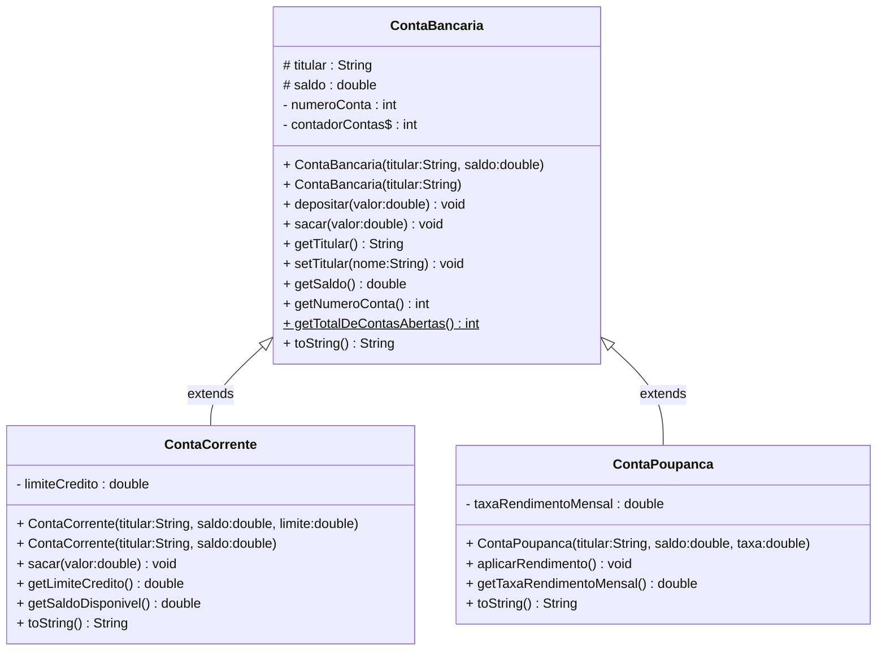

# Aula 06 — Construtores e Herança

## 🎯 Objetivos de Aprendizagem

Ao final desta aula, você será capaz de:

- Explicar o papel do **construtor** e distinguir o construtor padrão do construtor parametrizado
- Criar **construtores sobrecarregados** e encadear chamadas com **`this(...)`** para eliminar duplicação
- Identificar o problema que a **Herança** resolve e aplicar o teste **"é-um"** (*is-a*) para validar hierarquias
- Declarar subclasses com **`extends`** e compreender o que é — e o que não é — herdado
- Chamar o construtor da superclasse com **`super(...)`** e entender por que ele deve ser a **primeira instrução**
- Sobrescrever métodos com **`@Override`** e invocar a implementação original via **`super.método()`**
- Aplicar o modificador **`protected`** como ponte entre `private` e `public` em hierarquias

---

## 1. O Problema que os Construtores Resolvem

Na aula anterior criamos a `ContaBancaria` com atributos `private` — o que é ótimo para proteger o estado. Mas existe uma lacuna: o que acontece se alguém instanciar um objeto sem definir nenhum valor?

```java
// ⚠️ SITUAÇÃO PROBLEMÁTICA
ContaBancaria conta = new ContaBancaria(); // construtor padrão vazio
// conta.titular    → null   (referência para nada)
// conta.saldo      → 0.0   (aceitável, mas não intencional)
// conta.numeroConta → 0    (número inválido no sistema)

System.out.println("Titular: " + conta.getTitular()); // imprime: "Titular: null"
conta.sacar(100.00);   // pode causar comportamento inesperado
```

O objeto existe na memória, mas está em um **estado indefinido**. Ele passou por cima de todas as regras de negócio que construímos com tanto cuidado. O **Construtor** é o mecanismo que garante que **nenhum objeto nasça em estado inválido**.

---

## 2. Construtores — A Garantia de um Nascimento Seguro

Um **construtor** é um bloco especial de código executado automaticamente no momento em que o objeto é criado com `new`. Sua responsabilidade é levar o objeto a um **estado inicial válido e consistente**.

A anatomia de um construtor tem três regras invioláveis:

1. O **nome é idêntico** ao nome da classe
2. **Não declara tipo de retorno** — nem mesmo `void`
3. É chamado **uma única vez**, no momento da criação do objeto

```java
public class ContaBancaria {
    private String titular;
    private double saldo;

    // ✅ Construtor: mesmo nome da classe, sem tipo de retorno
    public ContaBancaria(String titular, double saldoInicial) {
        setTitular(titular);       // reutiliza a validação já existente no setter
        if (saldoInicial >= 0) {
            this.saldo = saldoInicial;
        }
    }
    //                ↑
    // Se tentasse escrever: void ContaBancaria(...) { }
    // o compilador trataria como um MÉTODO comum, não um construtor.
}
```

### O Construtor Padrão (*Default Constructor*)

Se você **não declarar nenhum construtor**, o compilador Java gera automaticamente um construtor padrão invisível, sem parâmetros e com corpo vazio:

```java
// O compilador gera isto implicitamente quando não há nenhum construtor:
public ContaBancaria() { }
```

> ⚠️ **Aviso de Professora:** Assim que você declara **qualquer** construtor explicitamente, o compilador **para de gerar** o construtor padrão. Se depois você precisar de `new ContaBancaria()` sem argumentos, terá que declará-lo você mesmo. Esse é um dos erros de compilação mais frequentes entre iniciantes: `"constructor ContaBancaria() is not applicable"`.

---

## 3. Sobrecarga de Construtores — Flexibilidade na Criação

Assim como métodos, construtores podem ser **sobrecarregados**: a mesma classe pode ter vários construtores, desde que com assinaturas diferentes (número ou tipos de parâmetros distintos).

```java
public class ContaBancaria {
    private String titular;
    private double saldo;
    private static int contadorContas = 1000;
    private int numeroConta;

    // Construtor 1: titular + saldo inicial
    public ContaBancaria(String titular, double saldoInicial) {
        setTitular(titular);
        this.saldo = (saldoInicial >= 0) ? saldoInicial : 0.0;
        this.numeroConta = contadorContas++;
    }

    // Construtor 2: apenas o titular (saldo inicial = 0.0)
    public ContaBancaria(String titular) {
        // ... repetição das mesmas três linhas do construtor acima? NÃO!
    }
}
```

Note o problema: o construtor 2 precisaria repetir toda a lógica do construtor 1. Qualquer alteração futura (ex: nova regra de validação) teria que ser replicada nos dois lugares. Isso é exatamente o tipo de duplicação que o Java nos permite evitar.

---

## 4. Encadeamento de Construtores com `this(...)`

A palavra-chave `this(...)`, quando usada **como primeira instrução de um construtor**, redireciona a chamada para **outro construtor da mesma classe**. É o mecanismo de **delegação de construtores**:

```java
public class ContaBancaria {
    private String titular;
    private double saldo;
    private static int contadorContas = 1000;
    private int numeroConta;

    // Construtor PRINCIPAL: contém toda a lógica de inicialização
    public ContaBancaria(String titular, double saldoInicial) {
        setTitular(titular);
        this.saldo = (saldoInicial >= 0) ? saldoInicial : 0.0;
        this.numeroConta = contadorContas++;
        System.out.printf("✅ Conta Nº %d criada para %s.%n", numeroConta, this.titular);
    }

    // Construtor de CONVENIÊNCIA: delega para o principal com saldo = 0.0
    public ContaBancaria(String titular) {
        this(titular, 0.0); // ← DEVE ser a primeira instrução; nada antes disso
    }

    // Construtor de CÓPIA: cria uma nova conta com os dados de outra existente
    public ContaBancaria(ContaBancaria origem) {
        this(origem.getTitular(), origem.getSaldo());
    }
}
```

**Por que isso importa?** Porque a lógica de validação e inicialização vive em **um único lugar**: o construtor principal. Os outros construtores apenas escolhem valores padrão e delegam. Quando a regra mudar, você altera somente o construtor principal.

> 💡 **Dica:** A chamada `this(...)` obrigatoriamente deve ser a **primeira linha** do construtor. Se você colocar qualquer instrução antes dela, o compilador rejeitará o código com: `"call to this must be first statement in constructor"`.

---

## 5. O Problema que a Herança Resolve

Com `ContaBancaria` bem modelada, o sistema bancário cresce e precisamos de novos tipos de conta: `ContaCorrente` (com limite de cheque especial) e `ContaPoupanca` (com rendimento mensal). Observe o que aconteceria **sem** herança:

```java
// ⚠️ EXEMPLO DO QUE NÃO FAZER — triplicação de código
public class ContaCorrente {
    private String titular;      // ← duplicado
    private double saldo;        // ← duplicado
    private int numeroConta;     // ← duplicado
    private double limiteCredito; // único desta classe

    public void depositar(double valor) { /* lógica duplicada */ }
    public void sacar(double valor)     { /* lógica duplicada */ }
    // getters/setters duplicados...
}

public class ContaPoupanca {
    private String titular;      // ← duplicado de novo
    private double saldo;        // ← duplicado de novo
    private int numeroConta;     // ← duplicado de novo
    private double taxaRendimento; // único desta classe

    public void depositar(double valor) { /* lógica duplicada OUTRA VEZ */ }
    public void sacar(double valor)     { /* lógica duplicada OUTRA VEZ */ }
}
```

Três classes, o mesmo `sacar()` implementado três vezes. Se a regra de saque mudar (ex: novo imposto), você precisa alterar em **três lugares** — e basta esquecer um para criar um bug silencioso.

> ✏️ **Aviso de Professora:** Quando você se pegar copiando e colando código entre classes, isso é um sinal de que a Herança provavelmente é a ferramenta certa para o problema.

---

## 6. Herança — A Relação "É-Um"

**Herança** permite que uma classe (**subclasse** ou classe filha) reutilize automaticamente os atributos e métodos de outra classe (**superclasse** ou classe mãe), podendo adicionar novos membros ou modificar os existentes.

A regra de ouro para verificar se uma hierarquia faz sentido é o **teste "é-um"** (*is-a*):

| Afirmação | Herança faz sentido? |
|---|---|
| Uma `ContaCorrente` **é uma** `ContaBancaria` | ✅ Sim |
| Uma `ContaPoupanca` **é uma** `ContaBancaria` | ✅ Sim |
| Um `Gerente` **é um** `Funcionario` | ✅ Sim |
| Uma `ContaBancaria` **é um** `Scanner` | ❌ Não — não há relação natural |
| Um `Motor` **é um** `Carro` | ❌ Não — Motor faz parte de um Carro (use composição) |

> 💡 **Dica:** Se a afirmação "A **é um** B" soar estranha ou forçada em português, a herança provavelmente não é a relação correta. Nesse caso, considere **composição** (um objeto contém outro).

A sintaxe em Java usa a palavra-chave **`extends`**:

```java
//         subclasse            superclasse
public class ContaCorrente extends ContaBancaria {
    // ContaCorrente herda TUDO que for public ou protected de ContaBancaria
    // e pode adicionar seus próprios membros exclusivos
    private double limiteCredito;
}
```

---

## 7. O que é (e o que não é) Herdado

Nem tudo passa automaticamente para a subclasse:

| Membro da superclasse | Herdado pela subclasse? |
|---|---|
| Atributos e métodos `public` | ✅ Sim |
| Atributos e métodos `protected` | ✅ Sim |
| Atributos e métodos `private` | ⚠️ Existem no objeto, mas **não são acessíveis diretamente** |
| Construtores | ❌ Não são herdados — cada classe tem os seus próprios |
| Membros com visibilidade de pacote | ✅ Sim, se estiverem no mesmo pacote |

> ⚠️ **Aviso de Professora:** Atributos `private` da superclasse **existem** no objeto da subclasse — eles ocupam espaço na memória e fazem parte do estado do objeto. A subclasse simplesmente **não pode acessá-los diretamente** pelo nome. O acesso se dá pelos métodos `public` ou `protected` herdados (os getters e setters). Por isso, o encapsulamento da aula anterior e a herança desta aula trabalham juntos.

---

## 8. `super(...)` — Iniciando a Superclasse Corretamente

Como construtores **não são herdados**, a subclasse precisa invocar explicitamente o construtor da superclasse usando **`super(...)`**. Assim como `this(...)`, a chamada `super(...)` deve ser **obrigatoriamente a primeira instrução** do construtor da subclasse.

Se você não chamar `super(...)` explicitamente, o compilador tenta inserir automaticamente uma chamada para `super()` (sem argumentos). Se a superclasse **não tiver** um construtor sem parâmetros, ocorre um erro de compilação.

```java
public class ContaCorrente extends ContaBancaria {

    private double limiteCredito;

    public ContaCorrente(String titular, double saldoInicial, double limiteCredito) {
        super(titular, saldoInicial); // ← 1ª instrução: inicializa a parte ContaBancaria
                                     //   equivale a "complete sua parte antes de eu completar a minha"

        // Só DEPOIS de super() podemos inicializar os membros próprios da subclasse
        this.limiteCredito = (limiteCredito >= 0) ? limiteCredito : 0.0;
    }

    // Construtor de conveniência: sem limite de crédito
    public ContaCorrente(String titular, double saldoInicial) {
        this(titular, saldoInicial, 0.0); // delega para o construtor principal desta classe
    }
}
```

### A Cadeia de Construção na Memória

Quando `new ContaCorrente("Ana", 500.0, 1000.0)` é executado, a sequência é:

```
1. ContaCorrente("Ana", 500.0, 1000.0) chama →
2. super("Ana", 500.0) — ContaBancaria é inicializada primeiro
   ├── setTitular("Ana")       → titular = "Ana"
   ├── saldo = 500.0
   └── numeroConta = 1000
3. ContaCorrente continua:
   └── limiteCredito = 1000.0
4. Objeto completamente inicializado ✅
```

> 💡 **Dica:** Pense na cadeia de construtores como uma **fila de montagem**: a peça mais fundamental (a superclasse) é montada primeiro, e as camadas mais especializadas (subclasses) vão sendo adicionadas em cima. O objeto só está pronto quando toda a cadeia termina.

---

## 9. Sobrescrita de Métodos com `@Override`

Herdar um método não significa que você é obrigado a usá-lo como está. A **sobrescrita** (*override*) permite que a subclasse forneça uma **implementação especializada** para um método já existente na superclasse.

Para sobrescrever, a assinatura do método na subclasse deve ser **idêntica** à da superclasse (mesmo nome, mesmos parâmetros, mesmo tipo de retorno). A anotação `@Override` instrui o compilador a verificar isso:

```java
public class ContaCorrente extends ContaBancaria {

    private double limiteCredito;

    // ... construtores omitidos para brevidade ...

    /**
     * Sobrescreve o sacar() de ContaBancaria para considerar o limite de crédito.
     * A lógica original verificava: valor <= saldo.
     * A nova lógica verifica: valor <= (saldo + limiteCredito).
     */
    @Override
    public void sacar(double valor) {
        if (valor <= 0) {
            System.out.println("❌ Erro: O valor do saque deve ser positivo.");
        } else if (valor > getSaldo() + limiteCredito) {
            System.out.printf("❌ Limite insuficiente. Disponível: R$%.2f%n",
                              getSaldo() + limiteCredito);
        } else {
            // Delegamos o débito efetivo para o sacar() da superclasse,
            // que já tem a lógica de decrementar o saldo.
            // Isso evita duplicar código e quebra o encapsulamento de 'saldo'.
            super.sacar(valor); // ← chama o sacar() de ContaBancaria
        }
    }
}
```

> ⚠️ **Aviso de Professora:** `@Override` é tecnicamente **opcional** — o código compila sem ela. Mas usá-la é uma **boa prática indispensável**: se você cometer um erro de digitação no nome do método (ex: `Sacar` em vez de `sacar`), sem `@Override` o compilador simplesmente cria um **novo método** sem avisar. Com `@Override`, o compilador exibe imediatamente o erro `"method does not override or implement a method from a supertype"`. Sempre use `@Override`.

---

## 10. `super.método()` — Reaproveitando a Lógica da Superclasse

Dentro de um método sobrescrito, `super.método()` chama a implementação **original da superclasse**. Isso é essencial para estender (e não duplicar) a lógica existente:

```java
public class ContaPoupanca extends ContaBancaria {

    private double taxaRendimentoMensal; // ex: 0.005 = 0,5% ao mês

    public ContaPoupanca(String titular, double saldoInicial, double taxa) {
        super(titular, saldoInicial);
        this.taxaRendimentoMensal = (taxa > 0 && taxa < 1) ? taxa : 0.005;
    }

    /**
     * Aplica o rendimento mensal ao saldo da conta.
     * O depósito efetivo usa o depositar() já validado da superclasse.
     */
    public void aplicarRendimento() {
        double rendimento = getSaldo() * taxaRendimentoMensal;
        super.depositar(rendimento); // reutiliza a lógica de depósito existente ✅
        System.out.printf("💰 Rendimento de R$%.2f aplicado.%n", rendimento);
    }

    // toString() que estende o toString() da superclasse
    @Override
    public String toString() {
        return super.toString() // ← pega o bloco visual de ContaBancaria...
             + String.format("%n║  Taxa    : %.2f%% ao mês          ║", taxaRendimentoMensal * 100);
        //                   ...e adiciona a linha de taxa embaixo
    }

    public double getTaxaRendimentoMensal() { return taxaRendimentoMensal; }
}
```

---

## 11. O Modificador `protected` — A Ponte da Herança

Na aula anterior, declaramos todos os atributos como `private`. Isso é correto e seguro. Mas há um cenário onde `private` se torna um obstáculo: quando a **subclasse** precisa de acesso mais direto aos dados da superclasse para implementar sua lógica especializada.

O modificador **`protected`** foi criado exatamente para esse caso:

| Modificador | Mesma Classe | Mesmo Pacote | Subclasse | Qualquer Lugar |
|---|---|---|---|---|
| `private` | ✅ | ❌ | ❌ | ❌ |
| `protected` | ✅ | ✅ | ✅ | ❌ |
| `public` | ✅ | ✅ | ✅ | ✅ |

```java
public class ContaBancaria {
    private   String titular;    // subclasses NÃO acessam diretamente — usam getTitular()
    protected double saldo;      // subclasses podem ler/escrever diretamente se necessário
    private   int    numeroConta;
}

public class ContaCorrente extends ContaBancaria {
    @Override
    public void sacar(double valor) {
        if (valor <= saldo + limiteCredito) { // ← acessa 'saldo' diretamente (protected)
            saldo -= valor;                  // ← modifica 'saldo' diretamente (protected)
        }
    }
}
```

> 💡 **Dica:** Na prática, a maioria dos projetos profissionais mantém atributos como `private` e acessa pela interface de getters/setters, mesmo nas subclasses. Isso mantém o encapsulamento rigoroso e facilita refatorações. Use `protected` com parcimônia — prefira-o quando a subclasse **precisa** de acesso direto por razões de performance ou design, e não apenas por conveniência.

---

## 12. A Classe `Object` — A Raiz de Tudo

Em Java, **toda classe herda implicitamente de `Object`**, mesmo que você não escreva `extends Object`. Isso significa que todo objeto Java tem garantidos os seguintes métodos:

| Método | O que faz por padrão | Por que sobrescrever? |
|---|---|---|
| `toString()` | Retorna `NomeClasse@endereçoMemória` | Para exibir os dados do objeto de forma legível |
| `equals(Object o)` | Compara **referências** (se são o mesmo objeto na memória) | Para comparar o **conteúdo** dos objetos |
| `hashCode()` | Retorna o endereço de memória como inteiro | Sempre que sobrescrever `equals()` |

Quando escrevemos `@Override public String toString()` em `ContaBancaria`, estamos sobrescrevendo o `toString()` de `Object`. É por isso que `System.out.println(conta1)` exibe nosso texto formatado — o `println` chama `toString()` internamente.

---

## 13. Diagrama de Classes UML — A Hierarquia Completa

A seta com triângulo vazio (`──▷`) indica herança na UML:



---

## 14. Implementação Completa

### 14.1 — `ContaBancaria.java` (superclasse revisada)

```java
/**
 * Superclasse que modela uma conta bancária genérica.
 * Fornece a estrutura base para todos os tipos de conta do sistema.
 *
 * @author Juliana Costa-Silva
 * @version 3.0
 */
public class ContaBancaria {

    // ── ATRIBUTOS ────────────────────────────────────────────────────────────
    private String titular;
    private double saldo;
    private int    numeroConta;
    private static int contadorContas = 1000;

    // ── CONSTRUTORES ─────────────────────────────────────────────────────────

    /**
     * Construtor principal: inicializa a conta com titular e saldo.
     */
    public ContaBancaria(String titular, double saldoInicial) {
        setTitular(titular);
        this.saldo       = (saldoInicial >= 0) ? saldoInicial : 0.0;
        this.numeroConta = contadorContas++;
        System.out.printf("[Sistema] Conta Nº %d aberta para '%s'.%n",
                          numeroConta, this.titular);
    }

    /**
     * Construtor de conveniência: conta com saldo inicial zero.
     */
    public ContaBancaria(String titular) {
        this(titular, 0.0); // delega para o construtor principal
    }

    // ── MÉTODOS DE NEGÓCIO ────────────────────────────────────────────────────

    public void depositar(double valor) {
        if (valor > 0) {
            this.saldo += valor;
            System.out.printf("✅ Depósito de R$%.2f | Novo saldo: R$%.2f%n",
                              valor, this.saldo);
        } else {
            System.out.println("❌ Erro: valor de depósito deve ser positivo.");
        }
    }

    public void sacar(double valor) {
        if (valor <= 0) {
            System.out.println("❌ Erro: valor de saque deve ser positivo.");
        } else if (valor > this.saldo) {
            System.out.printf("❌ Saldo insuficiente. Saldo atual: R$%.2f%n", this.saldo);
        } else {
            this.saldo -= valor;
            System.out.printf("✅ Saque de R$%.2f | Novo saldo: R$%.2f%n",
                              valor, this.saldo);
        }
    }

    // ── GETTERS E SETTERS ─────────────────────────────────────────────────────

    public String getTitular() { return titular; }

    public void setTitular(String nome) {
        if (nome != null && nome.trim().length() >= 3) {
            this.titular = nome.trim();
        } else {
            this.titular = "Titular Inválido";
            System.out.println("⚠️ Nome inválido. Usando 'Titular Inválido'.");
        }
    }

    public double getSaldo()      { return saldo; }
    public int    getNumeroConta() { return numeroConta; }

    public static int getTotalDeContasAbertas() {
        return contadorContas - 1000;
    }

    // ── toString() ────────────────────────────────────────────────────────────

    @Override
    public String toString() {
        return String.format(
            "╔══════════════════════════════════╗%n" +
            "║  %-8s  Conta Nº %-6d       ║%n" +
            "║  Titular : %-21s ║%n" +
            "║  Saldo   : R$ %,-12.2f      ║%n" +
            "╚══════════════════════════════════╝",
            getClass().getSimpleName(), numeroConta, titular, saldo
        );
    }
}
```

### 14.2 — `ContaCorrente.java`

```java
/**
 * Conta Corrente: estende ContaBancaria adicionando limite de crédito.
 * O titular pode sacar até (saldo + limiteCredito).
 */
public class ContaCorrente extends ContaBancaria {

    private double limiteCredito;

    // ── CONSTRUTORES ─────────────────────────────────────────────────────────

    public ContaCorrente(String titular, double saldoInicial, double limiteCredito) {
        super(titular, saldoInicial); // ← inicializa a parte ContaBancaria PRIMEIRO
        this.limiteCredito = (limiteCredito >= 0) ? limiteCredito : 0.0;
    }

    public ContaCorrente(String titular, double saldoInicial) {
        this(titular, saldoInicial, 0.0);
    }

    public ContaCorrente(String titular) {
        this(titular, 0.0, 0.0);
    }

    // ── COMPORTAMENTO ESPECIALIZADO ───────────────────────────────────────────

    /**
     * Sobrescreve sacar() para considerar o limite de crédito.
     * Usa super.sacar() para reaproveitar a lógica de débito já validada.
     */
    @Override
    public void sacar(double valor) {
        if (valor <= 0) {
            System.out.println("❌ Erro: valor de saque deve ser positivo.");
        } else if (valor > getSaldoDisponivel()) {
            System.out.printf(
                "❌ Limite insuficiente. Disponível: R$%.2f (Saldo: R$%.2f + Limite: R$%.2f)%n",
                getSaldoDisponivel(), getSaldo(), limiteCredito
            );
        } else {
            super.sacar(valor); // ← delega o débito efetivo para ContaBancaria
        }
    }

    /**
     * Retorna o total disponível para saque: saldo + limite de crédito.
     */
    public double getSaldoDisponivel() {
        return getSaldo() + limiteCredito;
    }

    public double getLimiteCredito() { return limiteCredito; }

    public void setLimiteCredito(double limite) {
        if (limite >= 0) this.limiteCredito = limite;
    }

    // ── toString() — estende o da superclasse ────────────────────────────────

    @Override
    public String toString() {
        // Substitui a última linha (╚) pelo dado extra e a reinsere
        String base = super.toString();
        String linhaNova = String.format(
            "║  Limite  : R$ %,-12.2f      ║%n" +
            "║  Disponív: R$ %,-12.2f      ║%n" +
            "╚══════════════════════════════════╝",
            limiteCredito, getSaldoDisponivel()
        );
        // Remove a última linha do toString() da superclasse e acrescenta as novas
        return base.substring(0, base.lastIndexOf("╚")) + linhaNova;
    }
}
```

### 14.3 — `ContaPoupanca.java`

```java
/**
 * Conta Poupança: estende ContaBancaria adicionando rendimento mensal.
 * A cada chamada de aplicarRendimento(), o saldo cresce pela taxa configurada.
 */
public class ContaPoupanca extends ContaBancaria {

    private double taxaRendimentoMensal;

    // ── CONSTRUTORES ─────────────────────────────────────────────────────────

    public ContaPoupanca(String titular, double saldoInicial, double taxa) {
        super(titular, saldoInicial);
        this.taxaRendimentoMensal = (taxa > 0 && taxa < 1) ? taxa : 0.005;
    }

    public ContaPoupanca(String titular, double saldoInicial) {
        this(titular, saldoInicial, 0.005); // taxa padrão: 0,5% ao mês
    }

    // ── COMPORTAMENTO ESPECIALIZADO ───────────────────────────────────────────

    /**
     * Calcula e credita o rendimento mensal sobre o saldo atual.
     * Reutiliza depositar() da superclasse para o crédito efetivo.
     */
    public void aplicarRendimento() {
        double rendimento = getSaldo() * taxaRendimentoMensal;
        super.depositar(rendimento);
        System.out.printf("💰 Rendimento de %.2f%% aplicado: +R$%.2f%n",
                          taxaRendimentoMensal * 100, rendimento);
    }

    public double getTaxaRendimentoMensal() { return taxaRendimentoMensal; }

    // ── toString() ────────────────────────────────────────────────────────────

    @Override
    public String toString() {
        String base = super.toString();
        String linhaNova = String.format(
            "║  Taxa    : %.3f%% ao mês              ║%n" +
            "╚══════════════════════════════════╝",
            taxaRendimentoMensal * 100
        );
        return base.substring(0, base.lastIndexOf("╚")) + linhaNova;
    }
}
```

### 14.4 — `Principal.java`

```java
public class Principal {

    public static void main(String[] args) {

        System.out.println("══════════════════════════════════════════");
        System.out.println("   SISTEMA BANCÁRIO v3.0 — HIERARQUIA     ");
        System.out.println("══════════════════════════════════════════\n");

        // ── 1. CRIAÇÃO — cada construtor dispara a cadeia super() ────────────
        ContaBancaria    base    = new ContaBancaria("Pedro Alves", 300.00);
        ContaCorrente    corrente = new ContaCorrente("Ana Lima", 500.00, 1000.00);
        ContaPoupanca    poupanca = new ContaPoupanca("Carlos Neto", 2000.00, 0.006);

        System.out.println();

        // ── 2. POLIMORFISMO — mesmo método, comportamentos diferentes ────────
        System.out.println("── Teste de Sacar (comportamentos diferentes) ──");

        base.sacar(400.00);      // falha: saldo insuficiente (sem limite)

        corrente.sacar(400.00);  // sucesso: saldo=500, limite=1000 → disponível=1500
        corrente.sacar(1200.00); // falha: ultrapassa o limite disponível restante

        System.out.println();

        // ── 3. MÉTODO EXCLUSIVO DA SUBCLASSE ────────────────────────────────
        System.out.println("── Rendimento da Poupança ──────────────────");
        poupanca.aplicarRendimento();

        System.out.println();

        // ── 4. RELATÓRIO FINAL ───────────────────────────────────────────────
        System.out.println("── Extrato Final ────────────────────────────");
        System.out.println(base);
        System.out.println();
        System.out.println(corrente);
        System.out.println();
        System.out.println(poupanca);

        System.out.println();

        // ── 5. DADO COMPARTILHADO PELA HIERARQUIA INTEIRA ───────────────────
        System.out.println("Total de contas no sistema: "
                           + ContaBancaria.getTotalDeContasAbertas());
    }
}
```

**Saída esperada:**

```
══════════════════════════════════════════
   SISTEMA BANCÁRIO v3.0 — HIERARQUIA
══════════════════════════════════════════

[Sistema] Conta Nº 1000 aberta para 'Pedro Alves'.
[Sistema] Conta Nº 1001 aberta para 'Ana Lima'.
[Sistema] Conta Nº 1002 aberta para 'Carlos Neto'.

── Teste de Sacar (comportamentos diferentes) ──
❌ Saldo insuficiente. Saldo atual: R$300,00
✅ Saque de R$400,00 | Novo saldo: R$100,00
❌ Limite insuficiente. Disponível: R$1.100,00 (Saldo: R$100,00 + Limite: R$1.000,00)

── Rendimento da Poupança ──────────────────
✅ Depósito de R$12,00 | Novo saldo: R$2.012,00
💰 Rendimento de 0,60% aplicado: +R$12,00

── Extrato Final ────────────────────────────
╔══════════════════════════════════╗
║  ContaBancaria  Conta Nº 1000   ║
║  Titular : Pedro Alves          ║
║  Saldo   : R$ 300,00            ║
╚══════════════════════════════════╝

╔══════════════════════════════════╗
║  ContaCorrente  Conta Nº 1001   ║
║  Titular : Ana Lima             ║
║  Saldo   : R$ 100,00            ║
║  Limite  : R$ 1.000,00          ║
║  Disponív: R$ 1.100,00          ║
╚══════════════════════════════════╝

╔══════════════════════════════════╗
║  ContaPoupanca  Conta Nº 1002   ║
║  Titular : Carlos Neto          ║
║  Saldo   : R$ 2.012,00          ║
║  Taxa    : 0,600% ao mês        ║
╚══════════════════════════════════╝

Total de contas no sistema: 3
```

---

## 15. Comparativo: Com e Sem Herança

| Critério | Sem Herança (3 classes independentes) | Com Herança |
|---|---|---|
| **Linhas de código** | `depositar()` escrito 3× | `depositar()` escrito **1×** na superclasse |
| **Correção de bug em `sacar()`** | Alterar em 3 lugares | Alterar em **1 lugar** |
| **Novo tipo de conta** | Copiar e colar tudo novamente | Criar subclasse, herdar o que existe, adicionar o que é novo |
| **Especialização de comportamento** | Impossível sem cópia | `@Override` — cirúrgico e seguro |
| **Consistência** | Risco de implementações divergirem | Comportamento base **garantido pela superclasse** |

---

## 16. Cadeia de Construtores — Resumo Visual

```
new ContaCorrente("Ana", 500.0, 1000.0)
│
├─► ContaCorrente(String, double, double)  ← construtor chamado
│       └─► super("Ana", 500.0)
│               └─► ContaBancaria(String, double)  ← executado PRIMEIRO
│                       ├── setTitular("Ana")
│                       ├── saldo = 500.0
│                       └── numeroConta = 1001
│
└─► Volta para ContaCorrente:
        └── limiteCredito = 1000.0
            Objeto pronto ✅
```

---

## 🛠️ Atividades Práticas

### Atividade 1 — Rastreando a Cadeia de Construtores

Adicione uma mensagem de impressão no **início** de cada construtor das três classes (`ContaBancaria`, `ContaCorrente`, `ContaPoupanca`):

```java
System.out.println("[DEBUG] Construtor de ContaCorrente(3 params) chamado");
```

Execute o `main` e observe a ordem das mensagens. Responda:

- Qual construtor é chamado primeiro quando `new ContaCorrente("Ana", 500.0, 1000.0)` é executado?
- Em qual ordem as mensagens aparecem no console?
- O que acontece se você remover a chamada `super(titular, saldoInicial)` de `ContaCorrente` e tentar compilar?

---

### Atividade 2 — Novo Tipo de Conta: `ContaSalario`

Crie a subclasse `ContaSalario` com as seguintes especificidades:

**Atributos exclusivos:**
- `private String empresaVinculada` — mínimo 3 caracteres
- `private int diaDeCredito` — dia do mês em que o salário cai (1 a 31)

**Construtores:**
- Principal: `ContaSalario(String titular, String empresa, int diaCredito)`
- De conveniência: `ContaSalario(String titular, String empresa)` — dia padrão: 5

**Comportamento sobrescrito:**
- `sacar()` — somente permite saque de **até 80%** do saldo de uma só vez (regra de proteção ao trabalhador); exibe mensagem específica se a regra bloquear

**Métodos exclusivos:**
- `creditarSalario(double valor)` — usa `super.depositar()` internamente
- `getEmpresaVinculada()` e `getDiaDeCredito()`
- `toString()` — estende o da superclasse exibindo empresa e dia de crédito

**Requisitos:**
- Valide `diaDeCredito` no setter (1–31); use 5 como padrão em caso inválido
- Escreva em `Principal` um teste com pelo menos 3 operações: crédito de salário, saque dentro do limite e saque que excede o limite de 80%

---

### Atividade 3 — `@Override` de `toString()` e `equals()`

Na classe `ContaBancaria`, sobrescreva o método `equals(Object o)` herdado de `Object`:

```java
@Override
public boolean equals(Object o) {
    // Duas contas são iguais se tiverem o MESMO numeroConta
}
```

**Requisitos:**
- Trate os casos: `o == null`, `o == this` e `!(o instanceof ContaBancaria)`
- Para acessar `numeroConta` do objeto `o`, faça o cast: `ContaBancaria outra = (ContaBancaria) o`
- Escreva um teste em `Principal` com dois objetos distintos que você force a ter o mesmo `numeroConta` (use Reflection ou simplesmente verifique o comportamento padrão primeiro)
- Responda: por que dois objetos com o mesmo conteúdo retornam `false` no `equals()` padrão de `Object`?

---

### Atividade 4 — Desafio: Hierarquia de Veículos

Construa do zero uma hierarquia de três níveis, aplicando tudo desta e da aula anterior:

**`Veiculo` (superclasse):**
- Atributos `protected`: `marca` (String), `modelo` (String), `ano` (int), `velocidadeAtual` (double)
- Construtor principal com os três primeiros atributos; validações nos setters
- Métodos: `acelerar(double incremento)`, `frear(double decremento)` (velocidade não pode ser negativa), `toString()`

**`Carro extends Veiculo`:**
- Atributo exclusivo: `numeroDePoratas` (int, 2 ou 4 — padrão 4)
- Sobrescreve `toString()` adicionando as portas
- Construtor com todos os atributos + porta de conveniência (4 portas)

**`CarroEletrico extends Carro`:**
- Atributo exclusivo: `percentualBateria` (double, 0–100)
- Sobrescreve `acelerar()`: só acelera se `percentualBateria > 10`; cada aceleração consume `incremento * 0.1` de bateria
- Método `recarregar(double percentual)` — soma ao percentual atual, máximo 100
- Construtor e `toString()` completos

**Teste em `TesteDriving.java`:** crie um `CarroEletrico`, tente acelerar com bateria baixa, recarregue e volte a acelerar; imprima o estado final.

---

## 📚 Referências e Leituras Recomendadas

| Recurso | Capítulos | Relevância |
|---|---|---|
| Deitel & Deitel — *Java: Como Programar* (10ª ed.) | Cap. 9 (Herança) — seções 9.1–9.5 | ⭐⭐⭐ Essencial |
| Horstmann & Cornell — *Core Java* Vol. I | Cap. 5.1 (Classes, Superclasses, Subclasses) e 5.2 (Object: Cosmic Superclass) | ⭐⭐⭐ Essencial |
| Silveira & Amaral — *Java SE 8 Programmer I* | Cap. 7 (Herança e Polimorfismo) | ⭐⭐ Recomendado |
| Oracle — [Java Tutorials: Inheritance](https://docs.oracle.com/javase/tutorial/java/IandI/subclasses.html) | — | ⭐⭐ Recomendado |

---

## 🚀 Próximos Passos

- Explorar **classes abstratas** (`abstract`) — superclasses que não podem ser instanciadas diretamente
- Compreender **interfaces** como contratos de comportamento independentes de hierarquia
- Estudar **polimorfismo** em profundidade: como uma variável `ContaBancaria` pode guardar uma `ContaCorrente`

---

*← [Aula 05 — Encapsulamento e Membros Estáticos](aula05.md) · [Aula 07 — Polimorfismo e Classes Abstratas →](./aula07.md)*

  *←[⬅️ Voltar ao Início](README.md)
